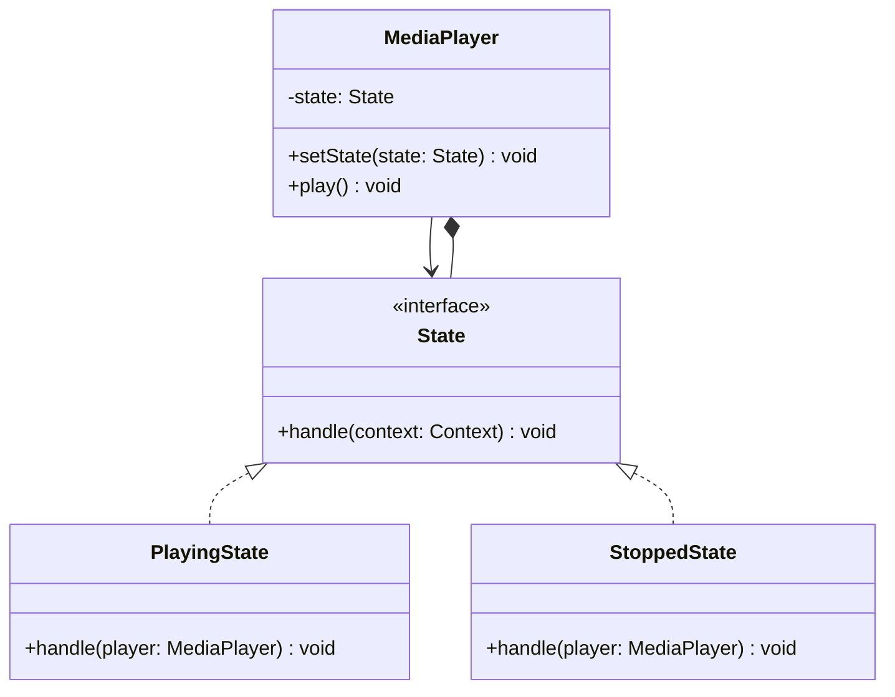
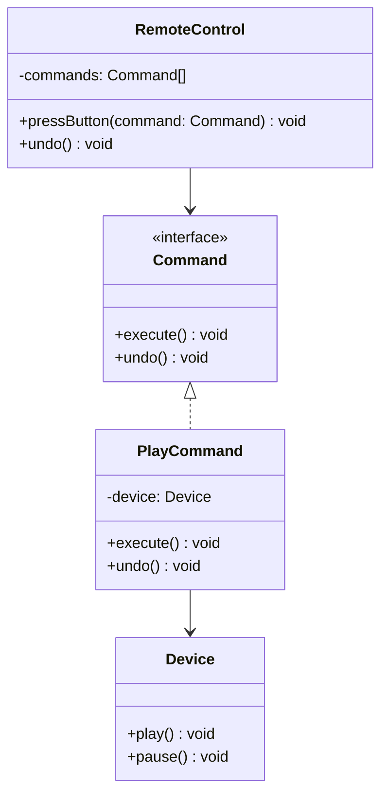

# State Pattern

الـ State Pattern معناه ببساطة:

إنك تغير سلوك الكائن حسب الحالة (state) بتاعته.

زي traffic light:

- RED: توقف
- YELLOW: استعد
- GREEN: تمشي

كل حالة بتاع سلوك مختلف.

---

## الفكرة الأساسية

بدل giant switch statement:

```typescript
if (state === "RED") { ... }
if (state === "YELLOW") { ... }
if (state === "GREEN") { ... }
```

تعمل state objects كل واحد فيها الحالة بتاعته:

```typescript
trafficLight.setState(new RedState());
trafficLight.setState(new YellowState());
trafficLight.setState(new GreenState());
```

---

## الحل باستخدام State

State interface:

```typescript
interface State {
    handle(context: Context): void;
}
```

Concrete states:

```typescript
class PlayingState implements State {
    handle(player: MediaPlayer): void {
        console.log("Already playing");
    }
}

class StoppedState implements State {
    handle(player: MediaPlayer): void {
        console.log("Playing...");
        player.setState(new PlayingState());
    }
}
```

Context (الكائن الرئيسي):

```typescript
class MediaPlayer {
    private state: State = new StoppedState();
    
    setState(state: State): void {
        this.state = state;
    }
    
    play(): void {
        this.state.handle(this);
    }
}
```

---

## المشكلة اللي بيحلها

بدون State Pattern:

```typescript
class MediaPlayer {
    play(): void {
        if (this.state === "STOPPED") {
            this.state = "PLAYING";
        } else if (this.state === "PAUSED") {
            this.state = "PLAYING";
        } else {
            console.log("Already playing");
        }
    }
}
```

الكود بيكبر بسرعة.

---

## المميزات

1. **Cleaner Code**: فصل الحالات عن بعضها
2. **Easy to Add States**: عايز حالة جديدة؟ class جديدة
3. **Single Responsibility**: كل state بيتصرف لنفسها
4. **Dynamic Behavior**: سلوك مختلف حسب الحالة

---

## الفرق بين State و Strategy

- **Strategy**: تختار طريقة التنفيذ (غالبا منفصلة)
- **State**: السلوك يتغير حسب الحالة (الحالات بتتغير داخل الكائن)

---

## الخلاصة

استخدم State Pattern لما الكائن يتصرف بطرق مختلفة حسب الحالة.

---

## Mermaid Diagram


# Command Pattern

الـ Command Pattern معناه ببساطة:

إنك تحول الطلبات (requests) لـ objects، بدل مجرد function calls.

زي لما تدي remote control لحد:

- كل button بيمثل command
- لما تضغط الزرار، الـ command بينفذ
- ممكن تأجل التنفيذ، تلغيه، أو تكرره

---

## الفكرة الأساسية

بدل الطلبات المباشرة:

```typescript
device.turnOn();
device.setVolume(50);
device.play();
```

تعمل command objects:

```typescript
const commands = [
    new TurnOnCommand(device),
    new SetVolumeCommand(device, 50),
    new PlayCommand(device)
];
```

---

## المشكلة اللي بيحلها

في الأنظمة الكبيرة، الطلبات متنوعة:

- Undo / Redo
- Scheduling
- Queueing
- Logging

الـ Command Pattern يخليك تتعامل معهم كـ objects موحدة.

---

## الحل باستخدام Command

Interface موحد:

```typescript
interface Command {
    execute(): void;
    undo(): void;
}
```

Commands مختلفة:

```typescript
class PlayCommand implements Command {
    constructor(private device: Device) {}
    execute(): void { this.device.play(); }
    undo(): void { this.device.stop(); }
}
```

Invoker (يطلب التنفيذ):

```typescript
class RemoteControl {
    private commands: Command[] = [];
    
    pressButton(command: Command): void {
        command.execute();
        this.commands.push(command);
    }
    
    undo(): void {
        this.commands.pop()?.undo();
    }
}
```

---

## المميزات

1. **Separation of Concerns**: الطلب منفصل عن التنفيذ
2. **Undo/Redo**: سهل تطبيقها
3. **Queueing**: تنفيذ لاحق
4. **Logging**: تسجيل العمليات

---

## الخلاصة

استخدم Command لما تريد:

- Undo/Redo
- Async execution
- Queueing
- Transaction logging

---

## Mermaid Diagram


