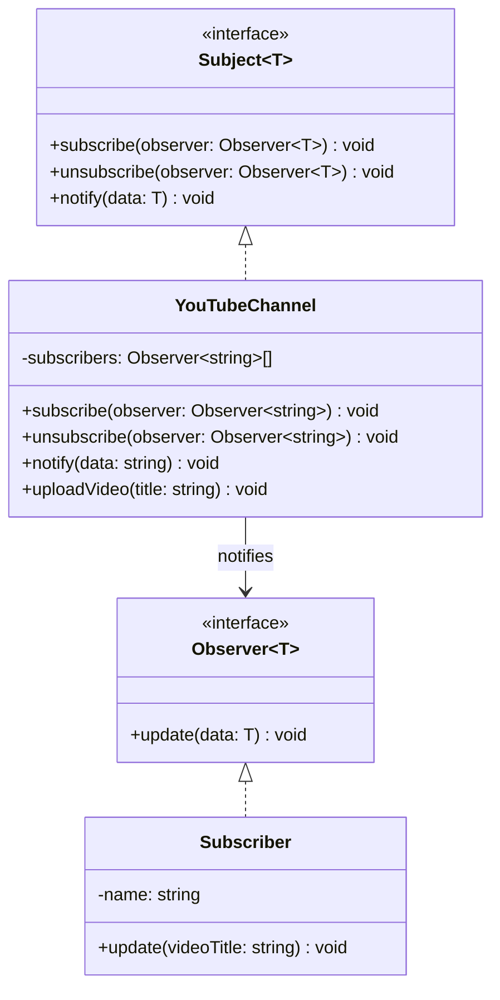

# Observer Pattern

الـ Observer Pattern معناه ببساطة:

عندك كائن بيحصل عنده حدث معين، وكائنات تانية مهتمة تعرف لما الحدث ده يحصل.

الكائنات المهتمة دي بتعمل subscribe، ولما الحدث يحصل، الكائن الأساسي يبعت لهم notification تلقائي.

زي YouTube:

- أنت عملت subscribe لقناة
- القناة نزلت فيديو جديد
- يوصلك notification

أنت هنا Observer، والقناة هي Subject (أو Observable).

---

## الفكرة الأساسية

بدل ما كل شوية تسأل:

- هل في فيديو جديد؟
- هل في فيديو جديد؟
- هل في فيديو جديد؟

تقول:

- لما يحصل فيديو جديد، بلغني.

وده أنظف وأكفأ.

---

## المشكلة اللي بيحلها

بدون Observer غالبا بنقع في:

- Polling مستمر
- Coupling عالي بين المكونات
- كود متكرر وصعب الصيانة

مثال سيئ:

```typescript
setInterval(() => {
    checkIfUserChanged();
}, 1000);
```

بدل السؤال المستمر، الأفضل استقبال التغيير وقت ما يحصل.

---

## الحل باستخدام Observer

نعمل interface للمشتركين:

```typescript
interface Observer<T> {
    update(data: T): void;
}
```

ونعمل Subject يدير الاشتراكات:

```typescript
interface Subject<T> {
    subscribe(observer: Observer<T>): void;
    unsubscribe(observer: Observer<T>): void;
    notify(data: T): void;
}
```

مثال بسيط (YouTube Channel):

```typescript
class YouTubeChannel implements Subject<string> {
    private subscribers: Observer<string>[] = [];

    subscribe(observer: Observer<string>): void {
        this.subscribers.push(observer);
    }

    unsubscribe(observer: Observer<string>): void {
        this.subscribers = this.subscribers.filter(s => s !== observer);
    }

    notify(videoTitle: string): void {
        this.subscribers.forEach(s => s.update(videoTitle));
    }

    uploadVideo(title: string): void {
        console.log(`New video uploaded: ${title}`);
        this.notify(title);
    }
}
```

---

## مثال الاستخدام

```typescript
class Subscriber implements Observer<string> {
    constructor(private name: string) {}

    update(videoTitle: string): void {
        console.log(`${this.name} got notification: ${videoTitle}`);
    }
}

const channel = new YouTubeChannel();
const ahmed = new Subscriber("Ahmed");
const sara = new Subscriber("Sara");

channel.subscribe(ahmed);
channel.subscribe(sara);
channel.uploadVideo("Observer Pattern Explained");
```

الناتج:

```text
New video uploaded: Observer Pattern Explained
Ahmed got notification: Observer Pattern Explained
Sara got notification: Observer Pattern Explained
```

---

## ليه Observer مفيد؟

ممتاز في منطق:

- لما يحصل كذا، اعمل كذا

أمثلة عملية:

- لما user يعمل login، حدث UI
- لما cart يتغير، حدث السعر
- لما backend يرجع error، اعرض notification
- لما form value يتغير، نفذ validation
- لما socket message توصل، حدث الشاشة

---

## Observer في Angular / RxJS

أنت بتستخدم Observer كتير جدا حتى لو مش بتسميه كده:

```typescript
this.userService.user$.subscribe(user => {
    this.user = user;
});
```

هنا:

- `user$` هو Observable
- الـ component هو Observer

مثال تاني:

```typescript
this.form.valueChanges.subscribe(value => {
    console.log(value);
});
```

---

## المميزات

1. تنبيه تلقائي: الـ subscribers يعرفوا فورا وقت الحدث.
2. تنظيم أفضل: كل جزء يسمع فقط للأحداث اللي تهمه.
3. أداء أفضل: بدل polling المستمر.
4. فصل المسؤوليات: الـ Subject لا يعرف تفاصيل تنفيذ الـ Observer.

---

## العيب الرئيسي

لو زاد بشكل مبالغ فيه ممكن تدخل في Event Callback Hell.

مثال سيئ:

```typescript
user$.subscribe(() => {
    settings$.subscribe(() => {
        permissions$.subscribe(() => {
            notifications$.subscribe(() => {
                console.log("Too much nesting");
            });
        });
    });
});
```

في RxJS استخدم operators أنضف مثل:

- `combineLatest`
- `switchMap`
- `mergeMap`
- `takeUntilDestroyed`

---

## إمتى تستخدم Observer؟

استخدمه لما يكون عندك events أو state changes وعايز أجزاء أخرى تتحدث تلقائيا.

أمثلة مناسبة:

- notifications
- form value changes
- route changes
- auth state
- cart updates
- websocket messages
- theme/language changes

## إمتى متستخدموش؟

لو العملية بسيطة ومباشرة:

```typescript
const total = price * quantity;
```

مفيش داعي تزود تعقيد.

---

## الفرق بين Observer و Strategy

- Strategy: تختار طريقة التنفيذ
- Observer: تسمع للحدث وتتفاعل لما يحصل

مثال:

- Strategy: الدفع كارت أو PayPal
- Observer: لما الدفع ينجح، ابعت email وحدث UI وسجل analytics

---

## الفرق بين Observer و Facade

- Facade: يبسط التعامل مع نظام معقد
- Observer: يربط أجزاء متعددة بالأحداث والتغييرات

---

## الخلاصة

الـ Observer Pattern ممتاز لما يكون عندك:

- events
- state changes
- async updates
- UI reactions

القاعدة السهلة:

> لو عندك جملة "لما يحصل كذا، بلّغ المهتمين" فكر في Observer.

---

## Mermaid Diagram


