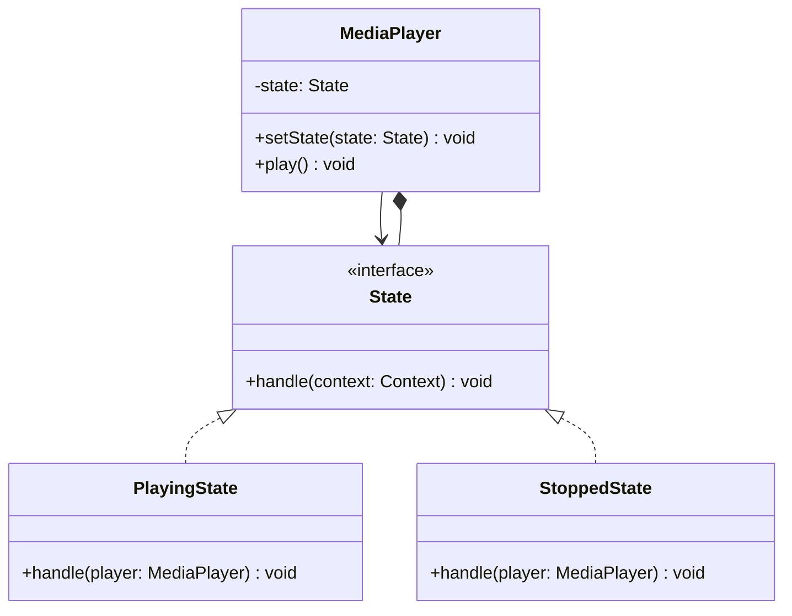
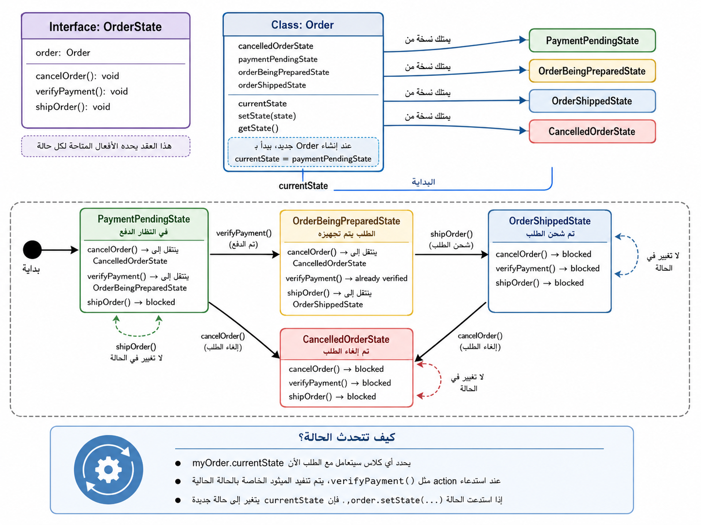
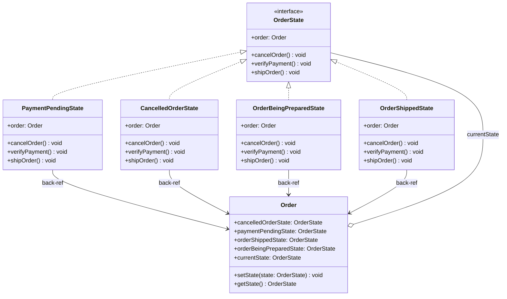
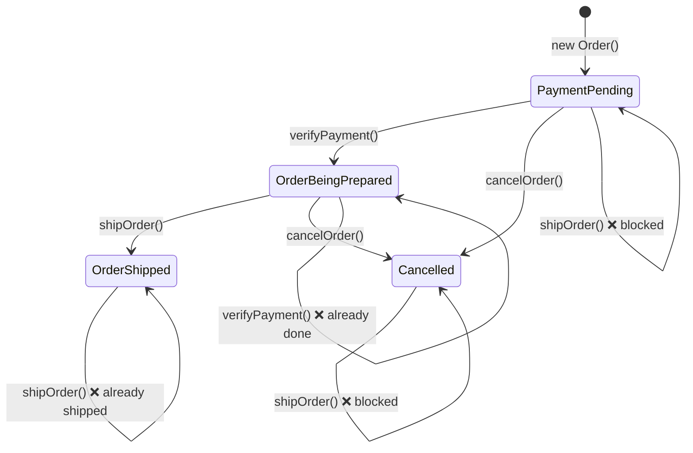

# State Pattern

الـ State Pattern معناه ببساطة:

إنك تغير سلوك الكائن حسب الحالة (state) بتاعته.

زي traffic light:

- RED: توقف
- YELLOW: استعد
- GREEN: تمشي

كل حالة بتاع سلوك مختلف.

---

## الفكرة الأساسية

بدل giant switch statement:

```typescript
if (state === "RED") { ... }
if (state === "YELLOW") { ... }
if (state === "GREEN") { ... }
```

تعمل state objects كل واحد فيها الحالة بتاعته:

```typescript
trafficLight.setState(new RedState());
trafficLight.setState(new YellowState());
trafficLight.setState(new GreenState());
```

---

## الحل باستخدام State

State interface:

```typescript
interface State {
    handle(context: Context): void;
}
```

Concrete states:

```typescript
class PlayingState implements State {
    handle(player: MediaPlayer): void {
        console.log("Already playing");
    }
}

class StoppedState implements State {
    handle(player: MediaPlayer): void {
        console.log("Playing...");
        player.setState(new PlayingState());
    }
}
```

Context (الكائن الرئيسي):

```typescript
class MediaPlayer {
    private state: State = new StoppedState();
    
    setState(state: State): void {
        this.state = state;
    }
    
    play(): void {
        this.state.handle(this);
    }
}
```

---

## المشكلة اللي بيحلها

بدون State Pattern:

```typescript
class MediaPlayer {
    play(): void {
        if (this.state === "STOPPED") {
            this.state = "PLAYING";
        } else if (this.state === "PAUSED") {
            this.state = "PLAYING";
        } else {
            console.log("Already playing");
        }
    }
}
```

الكود بيكبر بسرعة.

---

## المميزات

1. **Cleaner Code**: فصل الحالات عن بعضها
2. **Easy to Add States**: عايز حالة جديدة؟ class جديدة
3. **Single Responsibility**: كل state بيتصرف لنفسها
4. **Dynamic Behavior**: سلوك مختلف حسب الحالة

---

## الفرق بين State و Strategy

- **Strategy**: تختار طريقة التنفيذ (غالبا منفصلة)
- **State**: السلوك يتغير حسب الحالة (الحالات بتتغير داخل الكائن)

---

## الخلاصة

استخدم State Pattern لما الكائن يتصرف بطرق مختلفة حسب الحالة.

---

## Mermaid Diagram



---

## Example: Order Lifecycle (State Machine)

### Visual Overview



### Class Relationships

`Order` holds references to all its possible states and delegates every action to `currentState`. Each state class holds a back-reference to `Order` so it can trigger transitions.



### State Transitions

This diagram shows which actions trigger a transition and which are blocked in each state.



Key points from the diagrams:

- `Order` never checks the current state with `if/switch` — it just calls `currentState.action()`.
- Each state decides **what happens** and **what the next state is**.
- Adding a new state (e.g. `RefundedState`) means adding one new class — nothing else changes.
