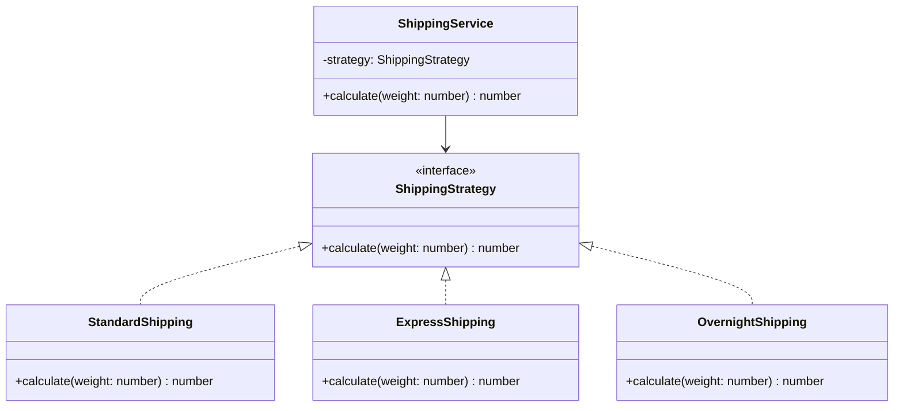

# Strategy Pattern

الـ Strategy Pattern معناه ببساطة:

عندك هدف واحد، لكن ممكن توصله بأكثر من طريقة.

بدل ما تحط كل الطرق جوه `if / else` طويلة، تفصل كل طريقة في class أو function لوحدها، وتخلي الكود يختار الطريقة المناسبة وقت التشغيل.

---

## مثال من الحياة

الهدف: تروح الشغل.

الطرق:

- Car
- Bike
- Walking
- Train

كلهم بيحققوا نفس الهدف: `goToWork()`

لكن كل واحد بطريقة مختلفة.

ده بالضبط هو Strategy Pattern.

---

## المشكلة اللي بيحلها

تخيل عندك كود زي ده:

```typescript
function calculateShipping(type: string, weight: number): number {
    if (type === "standard") {
        return weight * 5;
    }
    if (type === "express") {
        return weight * 10;
    }
    if (type === "overnight") {
        return weight * 20;
    }
    return 0;
}
```

الكود ده شغال، بس مع الوقت هيكبر.

لو أضفت نوع جديد:

- international
- same-day
- pickup

هتفضل تعدل نفس function، وتزود `if` جديدة.

ده بيخلي الكود صعب القراءة، وصعب الاختبار، وسهل جدًا يحصل فيه bug.

---

## الحل باستخدام Strategy

نعمل interface مشترك:

```typescript
interface ShippingStrategy {
    calculate(weight: number): number;
}
```

وبعدين كل طريقة شحن تبقى strategy مستقلة:

```typescript
class StandardShipping implements ShippingStrategy {
    calculate(weight: number): number {
        return weight * 5;
    }
}

class ExpressShipping implements ShippingStrategy {
    calculate(weight: number): number {
        return weight * 10;
    }
}

class OvernightShipping implements ShippingStrategy {
    calculate(weight: number): number {
        return weight * 20;
    }
}
```

بعد كده الكود الأساسي يستخدم الـ interface فقط:

```typescript
class ShippingService {
    constructor(private strategy: ShippingStrategy) {}

    calculate(weight: number): number {
        return this.strategy.calculate(weight);
    }
}
```

الاستخدام:

```typescript
const shipping = new ShippingService(new ExpressShipping());
console.log(shipping.calculate(3)); // 30
```

هنا `ShippingService` مش فارق معاه نوع الشحن إيه.

هو يعرف بس إن عنده strategy فيها method اسمها `calculate`.

---

## الفكرة الأساسية

بدل ما تقول:

```
if type is express → do this
if type is standard → do that
if type is overnight → do something else
```

تقول:

```
استخدم الاستراتيجية دي
```

والاستراتيجية نفسها تعرف تعمل شغلها.

---

## المميزات

### أول ميزة: بتتخلص من كابوس if / else

بدل function ضخمة فيها شروط كتير، كل behavior يبقى في مكانه.

### ثاني ميزة: الكود مفتوح للإضافة ومغلق للتعديل

لو عايز تضيف نوع شحن جديد:

```typescript
class InternationalShipping implements ShippingStrategy {
    calculate(weight: number): number {
        return weight * 30;
    }
}
```

مش محتاج تعدل `ShippingService`. أنت أضفت class جديد وخلاص.

ده اسمه **Open-Closed Principle**.

### ثالث ميزة: تقدر تبدل السلوك وقت التشغيل

```typescript
let strategy: ShippingStrategy;
if (user.isPremium) {
    strategy = new ExpressShipping();
} else {
    strategy = new StandardShipping();
}
const shipping = new ShippingService(strategy);
```

الكود الأساسي ثابت، واللي بيتغير هو الـ strategy.

---

## مثال قريب من الفرونت إند

تخيل عندك طرق مختلفة لفلترة جدول:

- filter by text
- filter by date
- filter by status
- filter by role

بدل ما تعمل function واحدة ضخمة:

```typescript
if (filterType === "text") { ... }
if (filterType === "date") { ... }
if (filterType === "status") { ... }
```

ممكن تعمل Strategies:

```typescript
interface FilterStrategy<T> {
    filter(data: T[]): T[];
}

class StatusFilterStrategy implements FilterStrategy<User> {
    constructor(private status: string) {}
    filter(data: User[]): User[] {
        return data.filter(user => user.status === this.status);
    }
}

class RoleFilterStrategy implements FilterStrategy<User> {
    constructor(private role: string) {}
    filter(data: User[]): User[] {
        return data.filter(user => user.role === this.role);
    }
}
```

الاستخدام:

```typescript
const filteredUsers = strategy.filter(users);
```

بدل ما component يبقى مليان شروط.

---

## مثال في Angular: Validation Strategies

```typescript
interface FormValidationStrategy {
    validate(form: unknown): boolean;
}

class DoctorValidationStrategy implements FormValidationStrategy {
    validate(form: unknown): boolean {
        // doctor validation logic
        return true;
    }
}

class NurseValidationStrategy implements FormValidationStrategy {
    validate(form: unknown): boolean {
        // nurse validation logic
        return true;
    }
}

class ClinicValidationStrategy implements FormValidationStrategy {
    validate(form: unknown): boolean {
        // clinic validation logic
        return true;
    }
}
```

بدل ما الكود يعرف كل التفاصيل:

```typescript
const isValid = validationStrategy.validate(form);
```

---

## العيب الرئيسي

ممكن تلاقي نفسك عملت classes كتير.

بدل ملف واحد فيه 20 `if / else`، ممكن يبقى عندك 20 class.

بس غالبًا ده أفضل، لأن كل class صغيرة وواضحة وسهل تختبرها.

---

## إمتى تستخدم Strategy؟

استخدمه لما يكون عندك أكثر من طريقة لتنفيذ نفس الحاجة:

- payment by card / PayPal / bank transfer
- sort by name / date / price
- export as PDF / Excel / CSV
- أو لما تلاقي function بدأت تكبر بسبب `if / else`

## إمتى متستخدموش؟

لو عندك طريقة واحدة فقط ومفيش بدائل:

```typescript
function calculateVat(price: number): number {
    return price * 0.19;
}
```

لو المنطق بسيط وثابت، Strategy هتزود تعقيد من غير فايدة.

---

## الفرق بين Strategy و Factory

```
Strategy = السلوك نفسه (طريقة الحساب، الفلترة، الدفع)
Factory  = يختار الاستراتيجية المناسبة
```

ممكن تستخدمهم مع بعض:

```typescript
class ShippingStrategyFactory {
    static create(type: string): ShippingStrategy {
        switch (type) {
            case "express":   return new ExpressShipping();
            case "overnight": return new OvernightShipping();
            default:          return new StandardShipping();
        }
    }
}

const strategy = ShippingStrategyFactory.create("express");
const service = new ShippingService(strategy);
```

الـ Factory اختار، والـ Strategy نفذت.

---

## الفرق بين Strategy و Adapter

```
Adapter  = يخلي حاجتين مش متوافقين يشتغلوا مع بعض
Strategy = يخليك تختار بين طرق مختلفة لتنفيذ نفس الهدف
```

مثال سريع:

- Adapter = يحوّل شكل API لشكل التطبيق
- Strategy = يختار طريقة الدفع أو الشحن أو الفلترة

---

## الخلاصة

الـ Strategy Pattern بيخليك تفصل الطرق المختلفة لتنفيذ نفس الهدف.

بدل `if / else` طويلة، تعمل strategies صغيرة وواضحة.

استخدمه لما يكون عندك أكثر من behavior لنفس العملية.

ولو المنطق بسيط ومفيش غير طريقة واحدة، بلاش تزود complexity.

> **قاعدة سهلة:** لو عندك جملة زي "حسب النوع اعمل كذا"، فكر في Strategy.

---

## Mermaid Diagram


