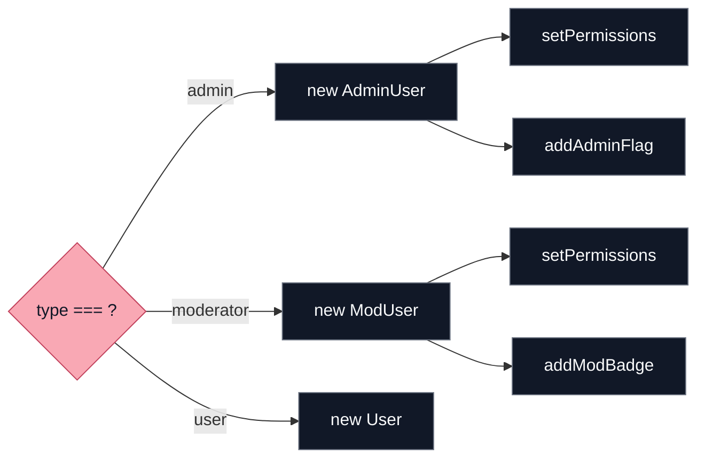

# Factory Pattern

الـ Factory Pattern معناه ببساطة:

بدل ما كل جزء في الكود يعمل object بنفسه باستخدام `new`، نخلي مكان واحد مسؤول عن إنشاء الـ objects. المكان ده اسمه Factory.

بدل:

```ts
const user = new AdminUser();
// أو
const user = new RegularUser();
```

نخلي المصنع هو اللي يقرر:

```ts
const user = UserFactory.createUser("admin");
```

## Diagrams

### Diagram: Without Factory (Messy)



### Diagram: With Factory (Clean)


## الفكرة الأساسية

الـ Factory بيجاوب على سؤال:

أنا محتاج object من نوع معين، مين ينشئهولي؟

بدل ما كل مكان في التطبيق يعرف تفاصيل الإنشاء، نخلي التفاصيل متجمعة في مكان واحد.

## مثال بسيط

```ts
interface User {
  getPermissions(): string[];
}

class AdminUser implements User {
  getPermissions(): string[] {
    return ["create", "read", "update", "delete"];
  }
}

class RegularUser implements User {
  getPermissions(): string[] {
    return ["read"];
  }
}

class ModeratorUser implements User {
  getPermissions(): string[] {
    return ["read", "update"];
  }
}

class UserFactory {
  static createUser(role: string): User {
    switch (role) {
      case "admin":
        return new AdminUser();
      case "moderator":
        return new ModeratorUser();
      default:
        return new RegularUser();
    }
  }
}
```

الاستخدام:

```ts
const user = UserFactory.createUser("admin");
console.log(user.getPermissions());
```

## المميزات

### 1) إخفاء التعقيد

بدل ما كل مكان يعرف إمتى ينشئ `AdminUser` أو `ModeratorUser` أو `RegularUser`، كل ده يبقى جوه الـ Factory.

### 2) الصيانة أسهل

لو طريقة إنشاء object اتغيرت، هتعدل غالبًا في مكان واحد.

### 3) تقليل تكرار if / switch

لو عندك نفس `switch` متكرر في كذا مكان، غالبًا Factory مناسب.

## مثال قريب من الفرونت إند

```ts
interface NotificationSender {
  send(message: string): void;
}

class EmailSender implements NotificationSender {
  send(message: string): void {
    console.log("Sending email:", message);
  }
}

class SmsSender implements NotificationSender {
  send(message: string): void {
    console.log("Sending SMS:", message);
  }
}

class PushSender implements NotificationSender {
  send(message: string): void {
    console.log("Sending push:", message);
  }
}

class NotificationFactory {
  static create(type: "email" | "sms" | "push"): NotificationSender {
    switch (type) {
      case "email":
        return new EmailSender();
      case "sms":
        return new SmsSender();
      case "push":
        return new PushSender();
    }
  }
}

const sender = NotificationFactory.create("email");
sender.send("Welcome Ahmed");
```

## العيوب

### 1) طبقة زيادة

الـ Factory بيضيف class أو function زيادة. لو المشروع بسيط جدًا، ممكن يبقى تعقيد على الفاضي.

### 2) الاعتماد على المصنع

لو كل الكود معتمد على `Factory` واحد، أي تغيير غلط فيه ممكن يأثر على أماكن كتير.

## إمتى تستخدم Factory؟

استخدمه لما:

- عندك أنواع مختلفة من نفس الفكرة (مثل: `AdminUser`, `RegularUser`, `ModeratorUser`).
- عندك `new` + `if/switch` متكرر في أماكن كتير.
- طريقة الإنشاء ممكن تتغير مع الوقت.

## إمتى متستخدموش؟

متستخدموش لو إنشاء الـ object بسيط وواضح، مثل:

```ts
const product = new Product("Laptop", 1200);
const user = new User(name, email);
```

## الفرق بين Factory و Builder

- Factory: بيختار نوع object وينشئه.
- Builder: بيبني object معقد خطوة بخطوة.

## الخلاصة

الـ Factory Pattern مفيد لما يكون عندك منطق إنشاء متكرر أو معقد.

بدل ما تنشر `new` و `switch` و `if-else` في كل المشروع، تجمعهم في مكان واحد.

لكن لو الـ object بسيط، خليك على `new` عادي، لأن Factory وقتها ممكن يبقى تعقيد زيادة.
