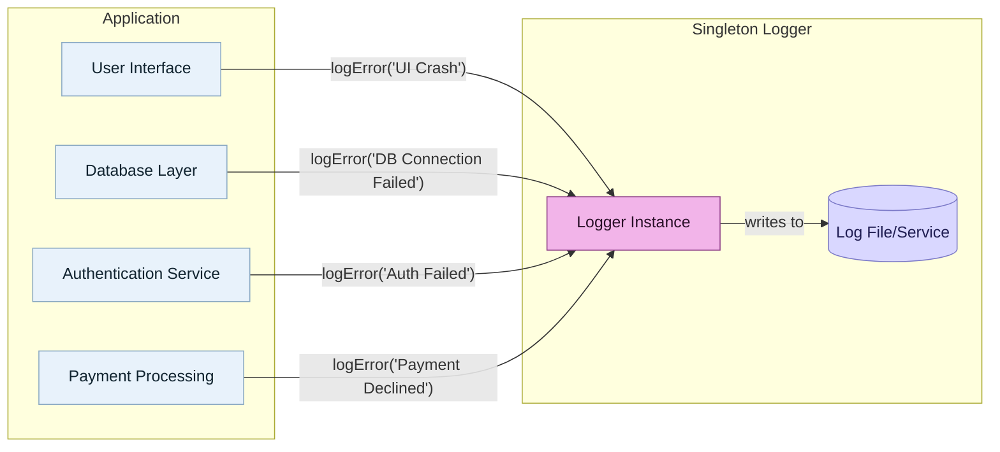
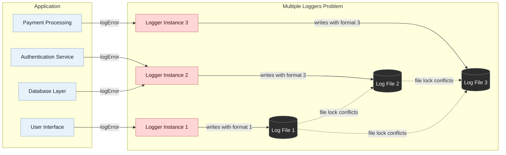
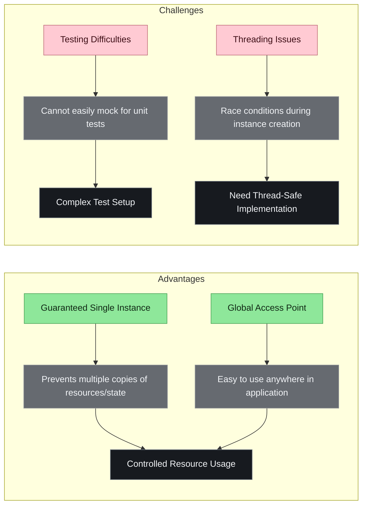
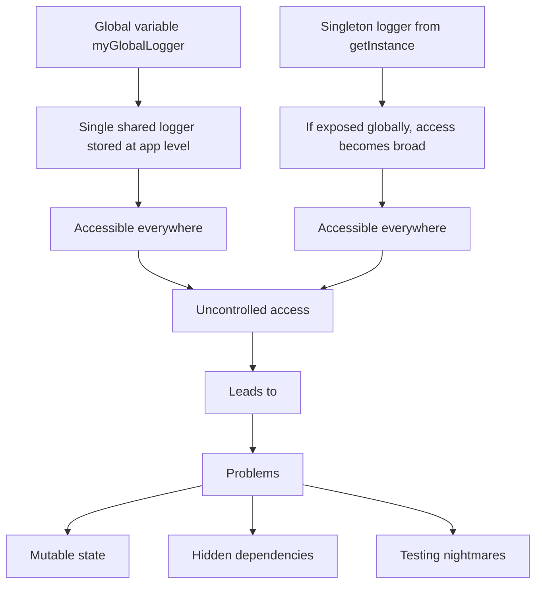

# Singleton Pattern

الـ Singleton Pattern يعني ببساطة:

عندي Class، وعايز أتأكد إن البرنامج كله يطلع منها نسخة واحدة فقط، وأي مكان في التطبيق يقدر يوصل لنفس النسخة دي.

تخيلها زي مكتب استقبال واحد في شركة. أي حد عايز يسأل أو يسجل حاجة بيروح لنفس المكتب، مش كل قسم يعمل مكتب استقبال لوحده.

## مثال بسيط

```ts
class Logger {
  private static instance: Logger;

  private constructor() {}

  static getInstance(): Logger {
    if (!Logger.instance) {
      Logger.instance = new Logger();
    }

    return Logger.instance;
  }

  log(message: string) {
    console.log(message);
  }
}

const logger1 = Logger.getInstance();
const logger2 = Logger.getInstance();

console.log(logger1 === logger2); // true
```

هنا logger1 و logger2 هما نفس الكائن بالضبط.

## ليه نستخدم Singleton؟

لما يكون عندك شيء منطقيًا لازم يبقى واحد فقط في التطبيق.

زي مثلًا:

- Logger: عايز كل الأخطاء والرسائل تتسجل بنفس الطريقة وفي نفس المكان.
- Configuration Service: إعدادات التطبيق، زي API URL أو language أو theme، غالبًا عايزها جاية من مكان واحد.
- Database Connection Pool: بدل ما كل جزء في التطبيق يفتح اتصال جديد بالداتابيز، يكون فيه مدير واحد للاتصالات.

## مشاكله إيه؟

### 1) Testing Difficulties

أول مشكلة، الاختبار صعب.

لأن الكلاس بقى مربوط عالميًا في كل حتة. لما تيجي تعمل unit test، صعب تبدله بنسخة fake أو mock.

مثال:

```ts
const logger = Logger.getInstance();
logger.log("Something happened");
```

الكود هنا مربوط مباشرة بـ Logger. لو عايز في test تمنع الطباعة أو تسجل الرسائل في array، الموضوع يبقى أرخم.

الأفضل غالبًا في Angular مثلًا تستخدم Dependency Injection بدل Singleton يدوي.

```ts
@Injectable({ providedIn: 'root' })
export class LoggerService {
  log(message: string) {
    console.log(message);
  }
}
```

ده برضه Singleton على مستوى التطبيق، بس Angular بيديره، وتقدر تعمل mock بسهولة في الاختبارات.

### 2) مشكلة الـ Global State

Singleton ساعات بيتحول لحاجة شبه global variable.

يعني أي مكان في التطبيق يقدر يغير حالته، فممكن تلاقي bug ومش عارف مين غيّر القيمة.

مثال سيئ:

```ts
class AppState {
  user: any;
  language: string;
  theme: string;
}
```

لو كل التطبيق بيعدل في نفس object، التحكم هيبقى صعب، خصوصًا مع الوقت.

### 3) مشكلة الـ Concurrency

في لغات أو بيئات فيها multi-threading، ممكن threadين ينادوا getInstance() في نفس اللحظة، فيطلع نسختين بدل نسخة واحدة.

في JavaScript العادي المشكلة دي أقل ظهورًا بسبب event loop، لكنها مهمة جدًا في لغات زي Java وC#.

## إمتى تستخدمه؟

استخدمه لما الشرط ده يكون حقيقي:

لازم يكون فيه نسخة واحدة فقط من الشيء ده في التطبيق كله.

أمثلة مناسبة:

- LoggerService
- ConfigService
- FeatureFlagService
- AnalyticsService

خصوصًا في Angular، خليه عن طريق DI:

```ts
@Injectable({ providedIn: 'root' })
export class ConfigService {}
```

## إمتى متستخدموش؟

ما تستخدموش لمجرد إنك عايز حاجة سهلة توصل لها من أي مكان.

يعني بدل ما تعمل:

```ts
AppState.getInstance().user = user;
```

فكر تستخدم:

- AuthService
- Store
- Signals Store
- NgRx
- Component Inputs

حسب الحالة.

## الخلاصة

Singleton مفيد، بس خطر لو اتستخدم غلط.

هو مناسب لما عندك resource واحد مشترك لازم يتدار مركزيًا، زي logging أو config أو connection pool.

لكن لو استخدمته كـ "شنطة عالمية" تحط فيها state التطبيق كله، هتعمل مشاكل في testing، debugging، والarchitecture.

في Angular، غالبًا أنت بتستخدم Singleton أصلًا بدون ما تسميه كده، لما تعمل service بـ:

```ts
@Injectable({ providedIn: 'root' })
```

ودي أنضف وأأمن طريقة في أغلب الحالات.

---

## Singleton (English Notes)

Use Singleton when one shared instance should coordinate access to a common resource such as logging, configuration, or caching.

According to the source, the Singleton pattern is a creational design pattern used to ensure a class has only one instance while providing a global point of access to it.

### Disadvantages of Using Singleton

- Testing Difficulties: It can be hard to test because it is not easy to mock in unit tests.
- Concurrency Issues: In multi-threaded environments, Singleton requires special handling to prevent creating multiple instances by mistake.
- Global Variable Risks: Singleton can become a glorified global variable if misused, which may cause architectural issues.

### When It Should Be Used

Use Singleton only when you truly need exactly one shared instance that is globally accessible across the application.

Common examples:

- Logging Systems: One central logger handles all errors with consistent formatting and writes to the same file or service.
- Database Connection Pools: A shared resource is managed through one centralized access point.

### When It Should Not Be Used

Do not use Singleton just because you want global state. It works well for specific problems, but not every problem needs a single global instance.

### Diagram: Singleton Logger (Recommended)



### Diagram: Multiple Loggers (No Bueno)



### Diagram: Singleton Advantages vs Challenges



### Diagram: Global Variable vs Singleton Access


