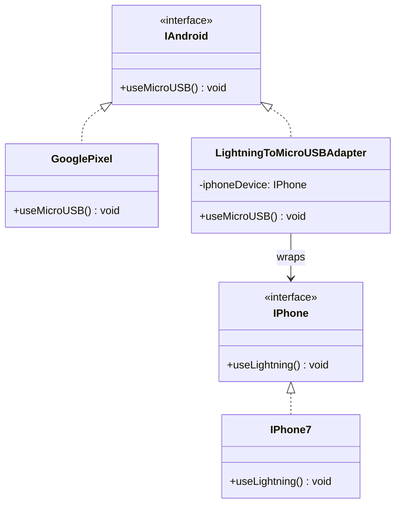
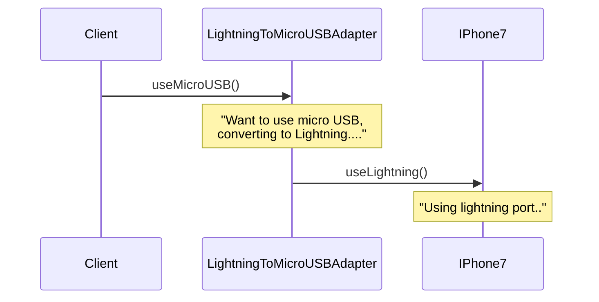

# Adapter Pattern

الـ Adapter Pattern معناه ببساطة:

عندك حاجتين مش عارفين يشتغلوا مع بعض، فتعمل بينهم "محوّل" يخليهم يفهموا بعض.

زي لما يكون عندك جهاز USB وعايز توصله على HDMI. الاتنين مش متوافقين مباشرة، فتستخدم Adapter بينهم.

في البرمجة نفس الفكرة.

## الفكرة الأساسية

الكود بتاعك متوقع شكل معين من البيانات أو `interface` معين.

لكن مكتبة خارجية أو API بيرجعلك شكل مختلف.

بدل ما تغيّر الكود كله، تعمل Adapter يحوّل الشكل المختلف للشكل اللي تطبيقك فاهمه.

## مثال بسيط (Weather)

تخيل تطبيقك شغال بدرجات الحرارة بالـ Celsius:

```ts
interface WeatherService {
  getTemperature(): number; // Celsius
}
```

لكن عندك API خارجي بيرجع الحرارة بالـ Fahrenheit:

```ts
class ExternalWeatherApi {
  getTempInFahrenheit(): number {
    return 77;
  }
}
```

بدل ما تكرر التحويل في كل مكان:

```ts
const celsius = (fahrenheit - 32) * 5 / 9;
```

نعمل Adapter:

```ts
class WeatherAdapter implements WeatherService {
  constructor(private externalApi: ExternalWeatherApi) {}

  getTemperature(): number {
    const fahrenheit = this.externalApi.getTempInFahrenheit();
    return (fahrenheit - 32) * 5 / 9;
  }
}
```

الاستخدام:

```ts
const api = new ExternalWeatherApi();
const weatherService = new WeatherAdapter(api);
console.log(weatherService.getTemperature()); // 25
```

## مثال من الفرونت إند

تخيل الـ backend بيرجع user بالشكل ده:

```ts
const apiUser = {
  first_name: "Ahmed",
  last_name: "Sadek",
  user_email: "ahmed@test.com"
};
```

لكن في Angular app أنت عايز الشكل ده:

```ts
interface User {
  fullName: string;
  email: string;
}
```

ممكن تعمل Adapter:

```ts
class UserAdapter {
  static fromApi(apiUser: any): User {
    return {
      fullName: `${apiUser.first_name} ${apiUser.last_name}`,
      email: apiUser.user_email
    };
  }
}
```

الاستخدام:

```ts
const user = UserAdapter.fromApi(apiUser);
console.log(user.fullName); // Ahmed Sadek
```

## ليه Adapter مفيد؟

- بيخلي الأنظمة المختلفة تشتغل مع بعض.
- بيجمع منطق التحويل في مكان واحد.
- بيحمي الكود من تغييرات الأنظمة الخارجية.

## مثال مع مكتبة خارجية

الكود متوقع notification service بالشكل ده:

```ts
interface NotificationService {
  send(message: string): void;
}
```

لكن مكتبة خارجية عندها method مختلفة:

```ts
class ThirdPartyMailer {
  sendEmail(body: string): void {
    console.log("Email sent:", body);
  }
}
```

نعمل Adapter:

```ts
class MailerAdapter implements NotificationService {
  constructor(private mailer: ThirdPartyMailer) {}

  send(message: string): void {
    this.mailer.sendEmail(message);
  }
}
```

الاستخدام:

```ts
const notificationService: NotificationService =
  new MailerAdapter(new ThirdPartyMailer());
notificationService.send("Welcome!");
```

## العيب الرئيسي

الـ Adapter بيزود طبقة إضافية.

لو كل حاجة صغيرة عملتلها Adapter، المشروع ممكن يبقى مليان classes زيادة بدون داعي.

## إمتى تستخدم Adapter؟

استخدمه لما:

- عندك API أو مكتبة خارجية مش ماشية مع شكل الكود بتاعك.
- عندك conversion بيتكرر في كذا مكان.
- عايز باقي التطبيق يتعامل مع interface ثابت.
- عايز تعزل الكود عن تفاصيل مكتبة خارجية.

## إمتى متستخدموش؟

متستخدموش لو الحاجة أصلًا متوافقة مع الكود بتاعك، أو لو التحويل بسيط جدًا وفي مكان واحد فقط.

## الفرق بين Adapter و Facade

- Adapter: تحويل وتوافق بين interfaces مختلفة.
- Facade: تبسيط واجهة نظام معقد.

## الفرق بين Adapter و Factory

- Factory: ينشئ objects.
- Adapter: يغيّر شكل التعامل مع object موجود أصلًا.

## الخلاصة

الـ Adapter Pattern هو مترجم بين كودك وبين حاجة تانية مش متوافقة معه.

مفيد جدًا مع APIs و third-party libraries وأي بيانات جاية بشكل مختلف.

استخدمه لما يكون فيه اختلاف حقيقي في الشكل أو الـ interface، ومتبالغش فيه لو التحويل غير ضروري.

---

## Example: Phone Charger Adapter (Lightning → MicroUSB)

### Class Relationships



Key points:

- `IPhone7` and `GooglePixel` are **incompatible** — they implement different interfaces.
- `LightningToMicroUSBAdapter` **implements `IAndroid`** so it can be used anywhere an Android device is expected.
- It also **holds a reference to `IPhone`** — that's the object being adapted.
- The client only ever talks to `IAndroid`; it never knows a Lightning port is involved.

### How the Call Flows



The adapter **translates** the `useMicroUSB()` call into a `useLightning()` call — the client and the iPhone never speak directly.
