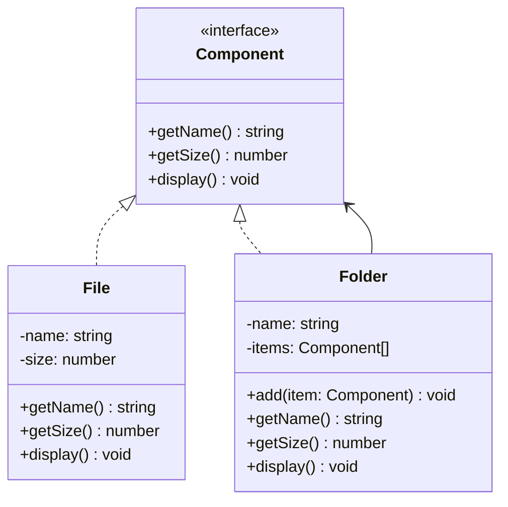

# Composite Pattern

الـ Composite Pattern معناه ببساطة:

إنك تعامل مع objects أفراد و groups بنفس الطريقة.

زي file system:

- File (فرد)
- Folder (مجموعة من files و folders)

بتعاملهم بنفس الواجهة.

---

## الفكرة الأساسية

دون Composite:

```typescript
if (isFile) {
    file.delete();
} else if (isFolder) {
    for (const item of folder.items) {
        item.delete();
    }
}
```

مع Composite:

```typescript
fileOrFolder.delete(); // نفس الكود للاثنين
```

---

## الحل باستخدام Composite

Component interface:

```typescript
interface FileSystemComponent {
    getName(): string;
    getSize(): number;
    display(): void;
}
```

Leaf (File):

```typescript
class File implements FileSystemComponent {
    constructor(private name: string, private size: number) {}
    
    getName(): string { return this.name; }
    getSize(): number { return this.size; }
    display(): void { console.log(`File: ${this.name}`); }
}
```

Composite (Folder):

```typescript
class Folder implements FileSystemComponent {
    private items: FileSystemComponent[] = [];
    
    constructor(private name: string) {}
    
    add(item: FileSystemComponent): void { this.items.push(item); }
    
    getSize(): number {
        return this.items.reduce((sum, item) => sum + item.getSize(), 0);
    }
    
    display(): void {
        console.log(`Folder: ${this.name}`);
        for (const item of this.items) {
            item.display();
        }
    }
}
```

الاستخدام:

```typescript
const root = new Folder("root");
root.add(new File("file1.txt", 10));
root.add(new File("file2.txt", 20));

const subFolder = new Folder("subfolder");
subFolder.add(new File("file3.txt", 30));
root.add(subFolder);

root.display(); // يعرض الكل recursively
console.log(root.getSize()); // 60
```

---

## المشكلة اللي بيحلها

بدون Composite:

```typescript
function calculateSize(item): number {
    if (item instanceof File) return item.size;
    if (item instanceof Folder) {
        return item.children.reduce((sum, child) => 
            sum + calculateSize(child), 0
        );
    }
}
```

كود متكرر في كل عملية.

---

## المميزات

1. **Uniform Interface**: نفس الواجهة للـ individual و composite
2. **Tree Structures**: سهل بناء أشجار معقدة
3. **Recursive Operations**: العمليات تشتغل recursive بشكل طبيعي

---

## الخلاصة

استخدم Composite لما عندك tree structure وتريد معاملة العقد بنفس الطريقة.

---

## Mermaid Diagram


