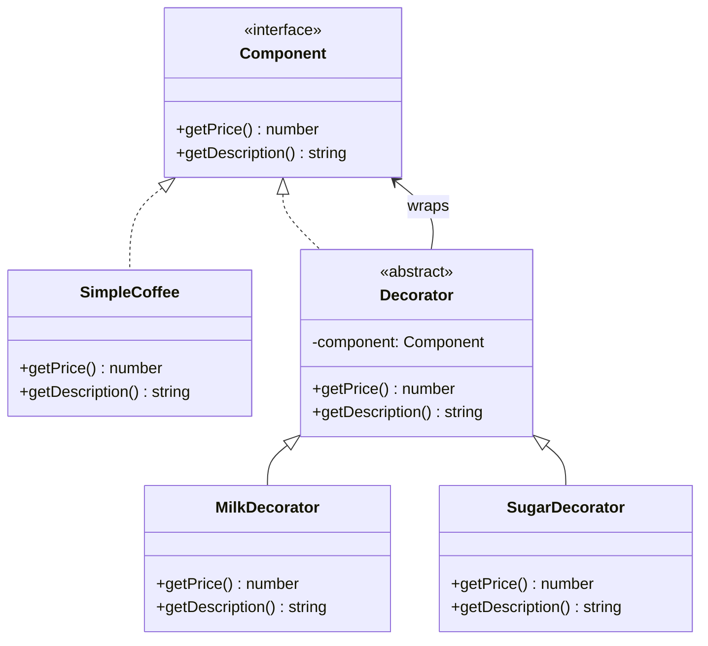
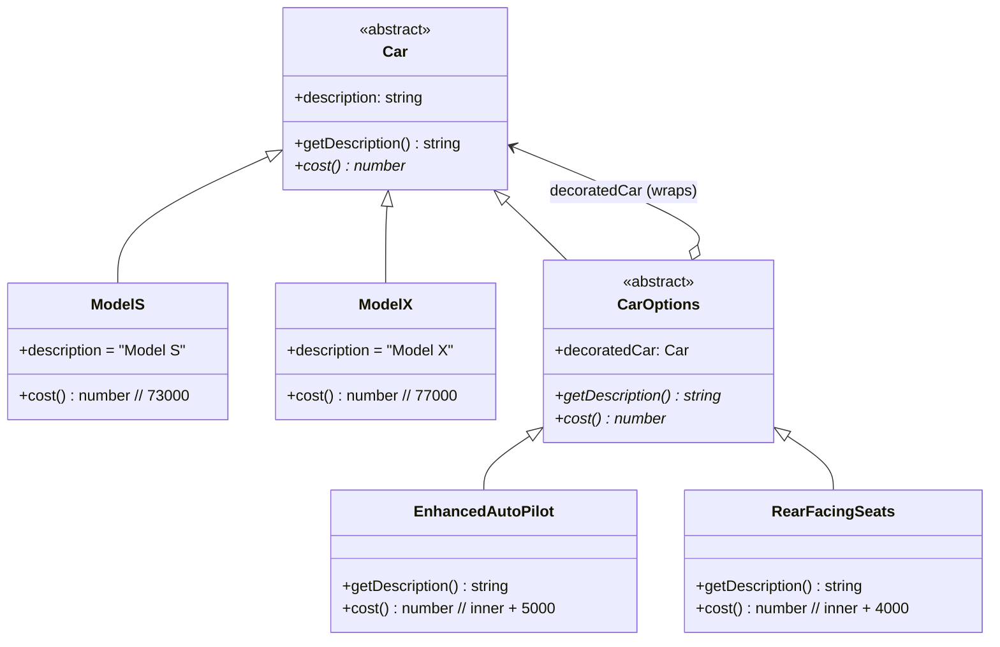
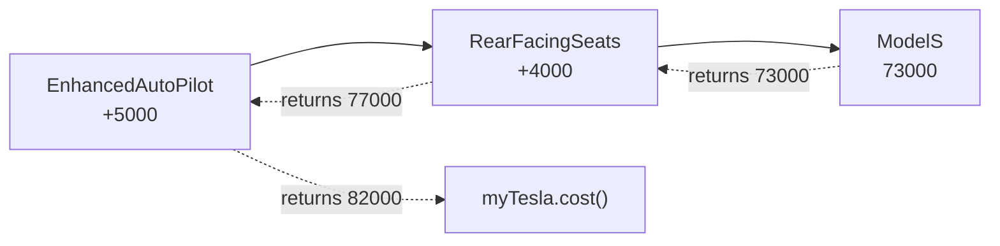

# Decorator Pattern

الـ Decorator Pattern معناه ببساطة:

إنك تضيف ميزات جديدة للكائن بدون تعديل الكلاس الأساسي.

زي لما تطلب قهوة، وتطلب عليها الحاجات الإضافية:

- قهوة عادية
- قهوة + حليب
- قهوة + حليب + كاراميل
- قهوة + حليب + كاراميل + شوكولاتة

كل واحد من الإضافات هو "decorator" بيلف حول القهوة الأساسية.

---

## الفكرة الأساسية

بدل ما تعمل subclass لكل combination:

```typescript
CoffeeWithMilk
CoffeeWithMilkAndSugar
CoffeeWithMilkAndSugarAndChocolate
```

تعمل decorators صغيرة كل واحد يضيف ميزة واحدة:

```typescript
Milk decorator
Sugar decorator
Chocolate decorator
```

وتلفهم حول بعضهم.

---

## الحل باستخدام Decorator

Interface أساسي:

```typescript
interface Component {
    getPrice(): number;
    getDescription(): string;
}
```

Concrete component:

```typescript
class SimpleCoffee implements Component {
    getPrice(): number { return 2; }
    getDescription(): string { return "Simple Coffee"; }
}
```

Decorators:

```typescript
class MilkDecorator implements Component {
    constructor(private coffee: Component) {}
    getPrice(): number { return this.coffee.getPrice() + 0.5; }
    getDescription(): string { return this.coffee.getDescription() + ", Milk"; }
}
```

الاستخدام:

```typescript
let coffee = new SimpleCoffee();
coffee = new MilkDecorator(coffee);
coffee = new SugarDecorator(coffee);
console.log(coffee.getPrice()); // 3
console.log(coffee.getDescription()); // Simple Coffee, Milk, Sugar
```

---

## المشكلة اللي بيحلها

بدون Decorator، تحتاج subclass لكل combination:

- CoffeeBasic
- CoffeeWithMilk
- CoffeeWithSugar
- CoffeeWithMilkAndSugar
- CoffeeWithMilkAndSugarAndChocolate
- ...

ده يبقى عددهم exponential.

---

## المميزات

1. **Runtime flexibility**: تضيف features وقت التشغيل
2. **Single Responsibility**: كل decorator بيفعل حاجة واحدة
3. **Open-Closed Principle**: مفتوح للإضافة، مغلق للتعديل
4. **Composition over Inheritance**: تركيب بدل وراثة

---

## العيب الرئيسي

ممكن تبقى السلسلة عميقة جدا:

```typescript
new A(new B(new C(new D(component))))
```

صعب تتبعها.

---

## Decorator في Angular

في Angular بتستخدم Decorators كتير (بس أنواع مختلفة قليلا):

```typescript
@Component({ ... })
@Directive({ ... })
@Input()
@Output()
```

ده مش نفس Design Pattern بس الفكرة شبه.

---

## الخلاصة

استخدم Decorator لما تريد:

- إضافة ميزات اختيارية لكائن
- تجنب explosion من الـ subclasses
- المرونة في Runtime

---

## Mermaid Diagram




---

## Detailed Extra Example: Car Options (Tesla)

This is the same Decorator idea in a more realistic product scenario.

- Base car: `ModelS` or `ModelX`
- Dynamic options:
  - `RearFacingSeats`
  - `EnhancedAutoPilot`
  - `PremiumSoundSystem`

```typescript
let myTesla: Car = new ModelS();
console.log(myTesla.getDescription()); // Model S
console.log(myTesla.cost()); // 73000

myTesla = new RearFacingSeats(myTesla);
myTesla = new EnhancedAutoPilot(myTesla);
myTesla = new PremiumSoundSystem(myTesla);

console.log(myTesla.getDescription());
// Model S, Rear facing seats, Enhanced AutoPilot, Premium Sound

console.log(myTesla.cost());
// 73000 + 4000 + 5000 + 2500 = 84500
```

Why this is useful:

- Every option is an independent decorator
- You can compose any combination at runtime
- No need to create a subclass for every possible combination

---

## Class Relationships (Tesla Example)

This diagram shows how `Car`, the concrete models, and the option decorators relate.
Notice that `CarOptions` **extends** `Car` AND **holds a reference to** `Car` — that's
the trick that lets a decorator be used anywhere a `Car` is expected, while also
wrapping another `Car` inside it.



Key points from the diagram:

- `ModelS` and `ModelX` are **concrete** cars — they know their own price.
- `CarOptions` is both a `Car` (so it fits everywhere a `Car` is expected) and **holds** a `Car` (the one being decorated).
- Each concrete decorator (`EnhancedAutoPilot`, `RearFacingSeats`) just **delegates** to `decoratedCar` and adds its own bit on top.

---

## How the Cost Builds Up (Layer by Layer)

When you wrap decorators around a base car, every call to `cost()` walks **inward**
to the base, then each layer adds its own price as the call returns **outward**.

Example: `new EnhancedAutoPilot(new RearFacingSeats(new ModelS()))`



Step-by-step cost calculation:

| Step | Object the variable points to                          | `cost()` returns         |
|------|--------------------------------------------------------|--------------------------|
| 1    | `ModelS`                                               | `73000`                  |
| 2    | `RearFacingSeats(ModelS)`                              | `73000 + 4000 = 77000`   |
| 3    | `EnhancedAutoPilot(RearFacingSeats(ModelS))`           | `77000 + 5000 = 82000`   |

And the description grows the same way:

```
"Model S"
"Model S, Rear facing seats"
"Model S, Rear facing seats, Enhanced AutoPilot"
```

Each decorator only knows about **the car it wraps** — not about the whole chain.
That's why you can stack them in any order and any combination without writing
a new subclass for each variation.
