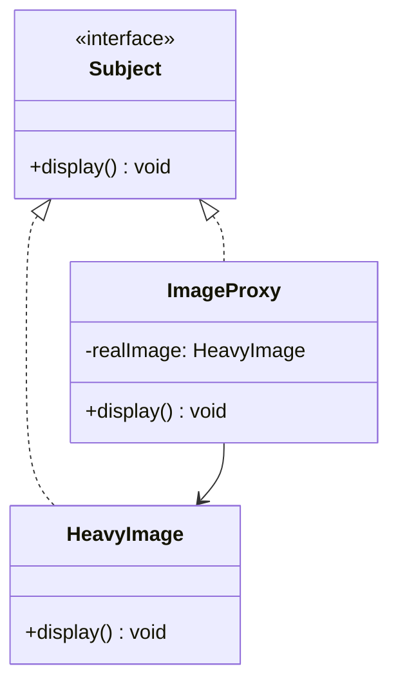

# Proxy Pattern

الـ Proxy Pattern معناه ببساطة:

إنك تعمل "وكيل" للوصول لموارد غالية.

زي التأشيرة (visa):

- بدل ما تدخل البلد مباشرة (غالي)
- تأخذ تأشيرة (وكيل) أولاً
- التأشيرة بتسيطر على الوصول

---

## الفكرة الأساسية

بدون Proxy، تحمّل كل شيء:

```typescript
class HeavyImage {
    constructor(filename: string) {
        this.loadImage(filename); // بطيء!
    }
}
```

مع Proxy (lazy loading):

```typescript
class ImageProxy {
    private realImage: HeavyImage | null = null;
    
    display(): void {
        if (!this.realImage) {
            this.realImage = new HeavyImage(); // حمّل وقت الحاجة
        }
        this.realImage.display();
    }
}
```

---

## الحل باستخدام Proxy

Subject interface:

```typescript
interface Image {
    display(): void;
}
```

Real subject:

```typescript
class HeavyImage implements Image {
    constructor() {
        console.log("Loading heavy image...");
        // بطيء جدا
    }
    
    display(): void {
        console.log("Displaying image");
    }
}
```

Proxy:

```typescript
class ImageProxy implements Image {
    private realImage: HeavyImage | null = null;
    
    display(): void {
        if (!this.realImage) {
            this.realImage = new HeavyImage();
        }
        this.realImage.display();
    }
}
```

الاستخدام:

```typescript
const image = new ImageProxy();
// ما حمّش الصورة بعد

image.display(); // الآن يحمّلها ويعرضها
image.display(); // مرة تانية بدون تحميل (موجود في memory)
```

---

## أنواع Proxies

1. **Virtual Proxy**: lazy loading (الحالة السابقة)
2. **Protection Proxy**: control access
3. **Remote Proxy**: access remote objects
4. **Logging Proxy**: log operations

---

## المشكلة اللي بيحلها

موارد غالية (صور كبيرة، اتصالات database، API calls):

- بدون Proxy: تحمّلها كل مرة
- مع Proxy: احمّلها لما تحتاج فقط

---

## المميزات

1. **Lazy Loading**: احمّل لما تحتاج
2. **Access Control**: كنترول من بيدخل
3. **Logging & Monitoring**: سجل الأنشطة
4. **Performance**: تجنب operations غالية

---

## الفرق بين Proxy و Adapter

- **Adapter**: يحول interface
- **Proxy**: يتحكم بالوصول (نفس interface)

---

## الخلاصة

استخدم Proxy لما عندك resources غالية وتريد:

- Lazy loading
- Access control
- Logging

---

## Mermaid Diagram


